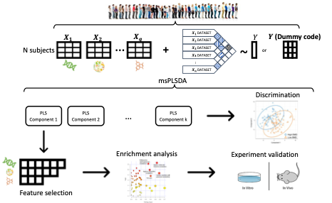

# Introduction

Welcome to the **msPLSDA** repository!

## Motivation
Multi-omics technologies have revolutionized our understanding of complex biological systems and their association with diseases. These technologies allow us to capture comprehensive molecular information from various biological factors, providing a systems biology perspective. However, integrating and analyzing multi-omics datasets pose significant challenges due to their high dimensionality and heterogeneity. Current methods for multi-omics integration often lack supervised approaches that can extract meaningful insights directly relevant to clinical phenotypes.

## Results
In this repository, we present **msPLSDA**, a novel method for multi-omics data analysis. **msPLSDA** utilizes multiset sparse Partial Least Squares Discriminant Analysis to simultaneously extract disease-relevant features from multiple data modalities and predict disease states within a unified and supervised framework. 

To demonstrate the effectiveness of **msPLSDA**, we conducted a comprehensive simulation study comparing it with existing methods. The results clearly indicate that **msPLSDA** outperforms other approaches in feature selection and discriminant analysis.

Furthermore, we applied **msPLSDA** to multi-omics data from the Louisiana Osteoporosis Study. Through this analysis, we identified genomic features that are significantly enriched in bone-related biological pathways. These findings underscore the effectiveness of **msPLSDA** in identifying critical features for downstream analyses, including the identification of disease biomarkers or therapeutic targets.

    

## Getting Started
To get started with **msPLSDA**, please refer to the DataSimulationStudy_msPLSDA.R for the usage of the **msPLSDA**.

## Repository Structure
- `2018_msPLS-master`: Directory containing the original code and files from the 2018 msPLS project.
- `DataSimulationStudy_msPLSDA.R`: R script for the data simulation study for msPLSDA.
- `LICENSE`: License information for the **msPLSDA** repository.
- `README.md`: This file, providing an introduction and instructions for using msPLSDA.
- `RealDataAnalysis`: Directory for storing files related to reading and analyzing data using msPLSDA.
- `figure`: Directory to store figures and images.

## License
**msPLSDA** is released under the [MIT License](LICENSE), granting users the freedom to use, modify, and distribute the software. However, please note that this repository includes third-party dependencies, each of which may have its own licensing terms. Please review the licenses of the respective dependencies before using this software.

We hope that **msPLSDA** will be a valuable tool for researchers and practitioners in the field of multi-omics analysis. If you have any questions or need further assistance, please don't hesitate to reach out. Enjoy exploring the potential of **msPLSDA** for your own multi-omics investigations!
